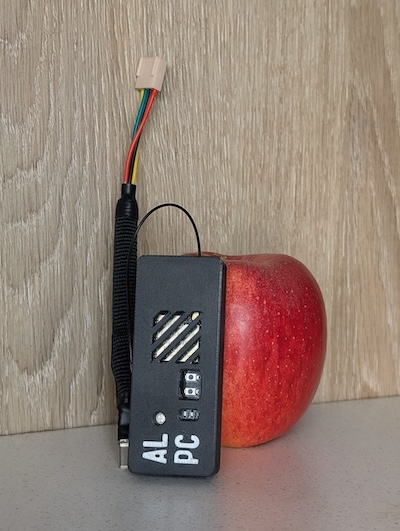

# gn-alarmoo — Paradox Alarm Wi-Fi & VPN Module

Connect a Paradox alarm panel to Home Assistant over Wi-Fi with optional VPN

> ⚠️ **Important:** Only one module can use the serial interface at a time. Remove any existing IP150 or GSM modules before connecting this one. Make sure your panel is not locked or running firmware with encrypted serial comms (maybe they have fixed this already? Don't update your panel's firmware if this works!).
> 
> 🔒 **Network Security:** The serial stream is exposed over the network **without authentication**.
> Anyone with access to port `10000` on the ESP can talk directly to your alarm panel.
> Keep the ESP on an isolated IoT Wi-Fi network or a dedicated VLAN with no external access.
> The Tailscale/VPN layer encrypts transit to HA, but does **not** protect the ESP itself from
> other devices on the same local network segment.

---

## How It Works

```
Paradox Panel  ──serial──►  ESP32-S3  ──Wi-Fi──►  [Tailscale VPN]  ──►  Home Assistant
                                                                              │
                                                                         PAI App + MQTT
```

The ESP32 exposes the panel's UART over Wi-Fi (port `10000`). The **Paradox Alarm Interface (PAI)** app in Home Assistant connects to it, decodes the data, and pushes it to an MQTT broker — making all zones, sensors and PGMs available as HA entities.

> ⚠️ **Important:** When using the Plug-and-Play cable, serial communication over USB must be redirected to `UART0` — making GPIO19/20 available for panel communication (port marked as "USB")
> 
> "Exit Node" MUST be enabled for the Home Assistant Tailscale App (default) when your ESP is behind heavily restricted NAT or cellular internet! Traffic must be routed through HA in these situations; otherwise, the module will not be reachable from other Headscale nodes. This is also the preferred configuration in general.
---

## Hardware

| Part | Notes |
|---|---|
| ESP32-S3 N16R8 (16MB flash, 8MB PSRAM) | Min 8MB flash and 8MB PSRAM is required for VPN support |
| External Wi-Fi antenna | Optional, helps in poor signal spots |
| 4-pin Molex KK / Dupont connector | Connects to panel serial port |
| DC buck step-down (12V → 5V) | Powers ESP from panel's 12VDC rail |
| USB Type-C connector (with data pins) | For module power and TX/RX |
| 24 AWG wire | Low current draw (~1W total) |

**Panel wiring (confirmed for SP7000 and SP7000+; swap TX/RX if no connection):**

```
Serial on Panel         BUCK              ESP32
┌───────┐               
│ Tx   ┌╵   == > == > == > == > == > == > RX
│ Rx   │    == > == > == > == > == > == > TX
│ GND  │    == > IN(-)   ->   OUT(-) == > USB GND 
│ AUX+ └╷   == > IN(+)   ->   OUT(+) == > USB 5V
└───────┘
```

✅ You can get one already built here: - [geriaune](https://link.geriaune.pro/gn-alarmoo)


---

## Status LED Indicator

The RGB LED provides visual feedback about the device's connection status:

| State | LED Color | Pattern | Meaning |
|-------|-----------|---------|---------|
| Booting | 🔴 Red | Blinking | Device initializing, WiFi not yet available |
| No WiFi | 🟡 Yellow | Blinking | Device is trying to connect to WiFi network |
| WiFi Only | 🔵 Blue | Solid | Connected to WiFi, VPN is not active |
| VPN Connected | 🟢 Green | Solid | Connected to WiFi and Tailscale VPN |

## Light Integration to HA

This light can be integrated with Home Assistant; however, there is limited practical value, since the entity status will become “Unavailable” whenever the module loses Wi-Fi/VPN connectivity or stops reporting to Home Assistant.

---

## Software Stack

Install these as **Home Assistant Apps/Add-ons**:

1. **ESPHome** — flashes and manages ESP32 firmware
2. **Mosquitto broker** — MQTT broker
3. **[Paradox Alarm Interface (PAI)](https://github.com/ParadoxAlarmInterface/pai)** — decodes panel data → MQTT
4. **Tailscale** — VPN (optional but recommended if HA is remote)

You also need a free [Tailscale](https://tailscale.com) account, or a self-hosted [Headscale](https://headscale.net) server.

---

## ESPHome Config (`paradox-*.yaml`)

Key settings — see the full file in this repo for the complete config.

⚠️ **Important:** :
> The following pasted Tailscale package and stream server `external_components` code is for the original repositories.
> The `paradox-*.yaml` files in this repo use explicit refs to my repository for supported alarm panels, so ESPHome upgrades are less likely to break your alarm panel integration.
> If you want the latest upstream version or a specific release, replace those YAML lines with the code shown below.

```yaml
...
# Route logging directly to UART0 port (away from default GPIO19/20)
logger:
  hardware_uart: UART0
  baud_rate: 115200
  
# Tailscale VPN package
packages:
  tailscale:
    url: https://github.com/Csontikka/esphome-tailscale
    ref: main
    files: [packages/tailscale/tailscale.yaml]
    refresh: 0s

tailscale:
  auth_key: !secret tailscale_auth_key
  hostname: "paradox"
  # login_server: "http://vpn.yourhost.com:8080"  # headscale only

external_components:
  - source: github://oxan/esphome-stream-server

stream_server:
  uart_id: paradox_uart
  port: 10000
...
```

> ⚠️ **Important:** Different panels may have different serial connection speed. Below are ones confirmed working:

| Panel | Baud rate |
|---|---|
| SP7000 | `9600` |
| SP7000+ | `115200` |


**Secrets to add in ESPHome:**
```yaml
wifi_ssid: "YourSSID"
wifi_password: "YourPassword"
tailscale_auth_key: "tskey-auth-****"   # generate one by adding a linux device in the Tailscale/Headscale
```

After flashing, find the Tailscale IP in the ESP logs or your Tailscale dashboard, then uncomment and set `use_address` in your ESPHome `paradox.yaml` file.

---

## PAI App Configuration

| Setting | Value |
|---|---|
| `CONNECTION_TYPE` | `IP` |
| `IP_CONNECTION_HOST` | Your Tailscale IP of ESP (`100.x.y.z`) |
| `IP_CONNECTION_PASSWORD` | Panel password (default: `paradox`) |
| `IP_CONNECTION_BARE` | ✅ Enable (⚠️ required!) — this hides under "Show unused optional configuration options" |
| `MQTT_ENABLE` | ✅ Enable |
| `MQTT_USERNAME` / `MQTT_PASSWORD` | Match Mosquitto broker user |
| `MQTT_HOST` | HA's local IP (find with `ha network info`) |
| `PASSWORD` | for SP7000: `0000` / for SP7000+: `a` |
| Port (Network section) | `10000` |

> Use the local HA IP (e.g. `192.168.0.222`), not `127.0.0.1` — it won't work inside Docker.

**Healthy PAI log output:**
```
INFO - Connection established
INFO - Panel Identified SP7000 version 7.0
INFO - Authentication Success
INFO - Connection OK
```

---

## ESPHome

Go to **HA Settings → Apps → ESPHome** and enable **"Use ping for status"**.
mDNS doesn't work across subnets (VPN), so ICMP ping is needed to show nodes as online.

---

## VPN IP Note

Every re-flash from PC or re-authentication assigns a new Tailscale IP. When that happens, update the IP in:
- ESPHome device config (`use_address`)
- PAI App (`IP_CONNECTION_HOST`)
- ESPHome integration in HA

---

## Credits

This component provides the ESPHome and ESP32 integration only. The wire protocol, WireGuard cryptography, discovery/STUN, and DERP implementations are all developed and maintained by upstream projects:

- [ESPHome](https://github.com/esphome/esphome)
- [Paradox Alarm Interface (PAI)](https://github.com/ParadoxAlarmInterface/pai)
- [esphome-tailscale](https://github.com/Csontikka/esphome-tailscale)
- [MicroLink v2 — ESP32 Tailscale Client](https://github.com/CamM2325/microlink)
- [esphome-stream-server](https://github.com/oxan/esphome-stream-server)

- [Full build article](https://geriaune.pro/howto/2026/05/01/10-paradox-alarm-wi-fi-and-vpn-module/)
- [Hardware](https://link.geriaune.pro/gn-alarmoo)

## Trademark & non-affiliation notice

This project is not affiliated with, sponsored by, or endorsed by Tailscale Inc., Jason A. Donenfeld, or the WireGuard project.

  "Tailscale" is a trademark of Tailscale Inc. "WireGuard" is a registered trademark of Jason A. Donenfeld. Both names are used here only to describe interoperability with the respective services and protocols. No Tailscale source code is included, copied, or redistributed in this repository — the protocol layer is provided by the separate, independently-maintained microlink library.

  This is an independent community effort for educational and interoperability purposes. The authors make no guarantees about security, correctness, stability, or compatibility with official Tailscale software, Upstream project changes or used hardware. Use at your own risk.
